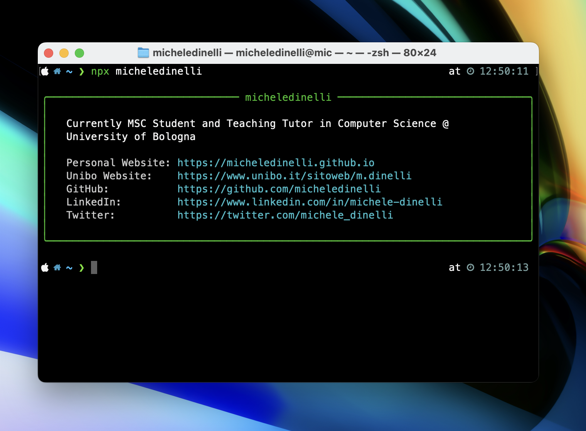

# cli-card

Cli card is a node.js project to show yout contact information directly on the cli.



## Installation

Clone this repo with

```
https://github.com/micheledinelli/cli-card.git
```

## Set up

Edit card.js adding your contact information. You'll find a json object; add and modify key-value pairs as you like.

```json
{
  "name": "<your-name>",
  "handle": "<your-handle>",
  "twitter": "https://twitter.com/your-twitter",
  "github": "https://github.com/your-github",
  "labelTwitter": "<twitter-label>",
  "labelGitHub": "<github-label>"
}
```

## Run

- In `package.json` modify `cli-card` with your desired entry command

  ```json
  "bin": {
      "cli-card": "./card.js"
  },
  ```

- Make `card.js` executable with

  ```sh
  chmod +x card.js
  ```

- Link package locally with

  ```sh
  npm link
  ```

- Run with
  ```sh
  npx command
  ```
  where `command` is **your handle**

## Ship it

- Login to npm using `npm login`
- Publish with `npm publish --access=public`

Remember to configure `package.json` properly before publishing. Modify package name

## Acknowledgments

Thanks to this really simple [tutorial](https://medium.com/@gn4rtistic/building-a-cli-contact-card-with-node-js-a-step-by-step-guide-1c409c5b1b35) for the idea and part of the code.
